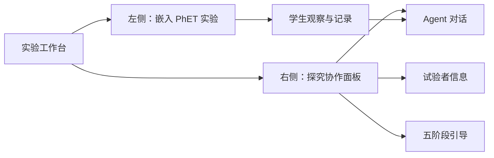

# 凸透镜探究智能实验平台 PRD

| 项目 | 内容 |
| --- | --- |
| 文档版本 | v0.4 |
| 日期 | 2026-09-16 |
| 阶段 | 产品与前端设计基线 |
| 目标平台 | Web，优先支持学校电脑与横屏平板 |
| 核心用户 | 参加物理探究学习的初中学生 |

## 1. 产品概述

### 1.1 背景

学生需要在操作凸透镜成像模拟实验的同时，经历科学探究的完整过程：观察并界定问题、提出假设、设计实验、采集证据、评估证据。单独的模拟器可以展示成像结果，但不能持续促使学生解释现象、记录证据并反思结论。

本产品在同一屏幕中组合实验操作区与对话式 Agent。Agent 不替学生完成实验，而是使用分阶段提示、追问和反馈，引导学生把操作行为转化为科学推理。

### 1.2 产品目标

- 学生无需切换页面即可操作凸透镜实验并获得探究引导。
- 用五个阶段按钮降低学生发起有效科学对话的门槛。
- Agent 能围绕学生从实验中报告的观察和数据进行提问和反馈，而不是只输出通用知识。
- 为课堂协作保留必要的试验者/小组上下文，避免不必要的个人信息采集。

### 1.3 成功指标

首版上线后可采用以下课堂观察指标，数值目标需在试教后校准：

| 指标 | 定义 | 初始目标 |
| --- | --- | --- |
| 五阶段到达率 | 一次会话中至少触发过 4 个不同阶段的学生组比例 | >= 70% |
| 有效证据对话率 | 会话包含物距/焦距或成像性质观察描述的比例 | >= 70% |
| 任务完成时间 | 从开始到提交结论的中位时间 | 课堂规定时间内 |
| 技术成功率 | 页面加载、实验交互及聊天均可完成的会话比例 | >= 95% |

## 2. 用户与使用场景

### 2.1 用户角色

| 角色 | 需求 | 权限 |
| --- | --- | --- |
| 学生/学生小组 | 操作实验、向 Agent 求助、形成结论 | 填写本组信息、操作实验、聊天 |
| 教师 | 组织课堂、查看完成情况（后续） | MVP 不提供后台；可提供任务编号 |
| 系统管理员 | 配置模型和运行环境（后续） | 不在学生界面暴露 |

### 2.2 典型场景

1. 两名学生打开课堂链接，填写班级、组号和昵称。
2. 学生在左侧嵌入的 PhET 实验中操作器材，观察实像、虚像、大小与倒正变化。
3. 学生依次点击五个探究按钮，由 Agent 提供当前阶段的科学方法提示与问题。
4. 学生把观察、预测和结论输入聊天区，Agent 通过追问帮助修正表述。
5. 学生在第五阶段对比假设和证据，完成本次探究结论。

## 3. 输入材料分析与关键决定

### 3.1 页面结构参考

用户提供的 `deepseek_html_20260527_520198.html` 只作为布局与右侧交互参考，包含信息表单、五阶段按钮和本地模拟聊天。正式产品重新实现右侧区域并接入真实 Agent，不复用该文件中的实验绘图脚本。

### 3.2 外部实验来源

用户指定左侧直接嵌入 PhET 网页，不自行开发模拟实验。2026-09-16 已核验：

| 页面 | 地址 | 用途 |
| --- | --- | --- |
| PhET 中文模拟平台 | [https://phet.colorado.edu/zh_CN/](https://phet.colorado.edu/zh_CN/) | 用户提供的平台入口 |
| 几何光学（透镜屏幕） | [https://phet.colorado.edu/sims/html/geometric-optics/latest/geometric-optics_zh_CN.html?screens=1](https://phet.colorado.edu/sims/html/geometric-optics/latest/geometric-optics_zh_CN.html?screens=1) | iframe 默认加载的中文 HTML5 仿真，可直接操作透镜、物体与光线 |

课堂应用直接加载中文“几何光学”的透镜屏幕，避免让学生先进入平台首页、搜索实验或选择镜面屏幕。

### 3.3 嵌入与联动决策

| 决策 | 说明 |
| --- | --- |
| 左栏内容 | 使用 iframe 直接承载 PhET 目标实验页面，不编写、复制或改造实验模型 |
| 嵌入初步可行性 | 2026-09-16 核验中文 HTML5 仿真直达页；上线前仍需在学校网络与目标浏览器复检 |
| 第三方访问条件 | 无登录或 VIP 流程；学校网络对 `phet.colorado.edu` 的可达性仍需在课堂试运行中验证 |
| 实验数据联动 | PhET 是跨域第三方页面；无官方通信接口前，MVP 不读取 iframe 内部物距、焦距或成像状态 |
| Agent 证据来源 | Agent 使用学生在聊天中主动描述或输入的数据，引导学生观察和记录，不声称自动观察了实验 |

## 4. 产品范围

### 4.1 MVP 范围

- 单页双栏实验工作台。
- 左侧以 iframe 嵌入 PhET 指定的凸透镜实验资源页面。
- 右侧试验者信息表单及会话内保存。
- 五个探究步骤按钮，触发已指定提示词。
- 对话式 Agent 的消息列表、输入和回复状态。
- 将学生在对话中报告的实验观察作为 Agent 请求上下文。
- 基础错误处理、键盘可操作性和响应式布局。

### 4.2 不在 MVP 范围

- 教师管理后台、班级统计仪表盘。
- 登录、长期学生档案与跨设备会话同步。
- 自动评分或对学生能力进行分类。
- 语音输入、图片识别、实验报告导出。
- 开发、复制、修改或维护凸透镜模拟实验本身。
- 未经 PhET 提供的官方协议自动读取其 iframe 内实验状态。

## 5. 信息架构与主流程

### 5.1 页面信息架构



### 5.2 学习流程

| 阶段 | 学生行为 | Agent 作用 | 阶段输出 |
| --- | --- | --- | --- |
| 进入实验 | 填写试验者信息，观察默认画面 | 说明任务和操作方式 | 小组上下文 |
| 1 观察与界定 | 描述可改变量与成像现象 | 示例说明如何提出科学问题 | 待研究问题 |
| 2 假设 | 预测变量变化后的像性质 | 解释可检验假设的准则 | 可验证假设 |
| 3 设计 | 规划改变/控制/观察变量 | 解释控制变量，并迁移到本实验 | 实验计划 |
| 4 采证 | 操作实验并记录观察 | 解释实像/虚像、焦点情形，追问数据 | 证据记录 |
| 5 评估 | 对照假设与观察作结论 | 解释不一致并促使反思 | 结论与改进建议 |

## 6. 功能需求

### 6.1 实验区

| 编号 | 需求 | 优先级 | 验收标准 |
| --- | --- | --- | --- |
| EXP-01 | 左侧嵌入 PhET 几何光学透镜屏幕 | P0 | iframe 直接加载中文“几何光学”仿真的透镜屏幕 |
| EXP-02 | 不自行实现模拟器 | P0 | 仓库不包含自行编写的成像绘图、物距控制或光路计算模块 |
| EXP-03 | 提供第三方加载反馈 | P0 | 加载超时或嵌入失效时显示说明及在新标签页打开 PhET 的备用操作 |
| EXP-04 | 固定实验来源配置 | P0 | 资源地址集中配置，默认指向已核验具体资源页而不是资源目录 |
| EXP-05 | 验证外部使用条件 | P1 | 联调记录学校网络可访问性、iframe 加载和新页面恢复入口 |

### 6.2 试验者信息

| 编号 | 需求 | 优先级 | 验收标准 |
| --- | --- | --- | --- |
| INFO-01 | 展示“试验者信息”卡片 | P0 | 页面右上方可识别，文案不暗示必须由教师填写 |
| INFO-02 | 收集最小必要信息 | P0 | 包含班级/任务编号（可选）、小组编号、成员昵称或姓名；无默认真实姓名 |
| INFO-03 | 信息保存反馈 | P0 | 点击保存后显示当前小组摘要并在对话中出现确认状态 |
| INFO-04 | 会话上下文使用信息 | P1 | Agent 可称呼小组编号或昵称，不输出未填写字段 |
| INFO-05 | 保护学生信息 | P0 | MVP 不默认持久化个人信息，界面告知仅用于本次实验会话 |

### 6.3 五阶段引导按钮

| 编号 | 需求 | 优先级 | 验收标准 |
| --- | --- | --- | --- |
| STEP-01 | 展示五个顺序明确的阶段按钮 | P0 | 按钮名称和阶段顺序与需求一致 |
| STEP-02 | 点击按钮触发指定提示词 | P0 | 每个按钮将对应的两条问题以结构化消息发送给 Agent；文本与 [AGENT_PROMPTS.md](AGENT_PROMPTS.md) 一致 |
| STEP-03 | 显示当前阶段状态 | P0 | 已激活步骤有可视状态，且不依赖颜色单独表达 |
| STEP-04 | 允许回看和重复提问 | P1 | 重复点击不会覆盖历史消息，可重新触发同阶段引导 |
| STEP-05 | 方法迁移说明 | P0 | 第 1 至 3 步提及滑动摩擦力示例时，Agent 在回复结尾提示如何迁移到当前凸透镜实验 |

### 6.4 对话式 Agent

| 编号 | 需求 | 优先级 | 验收标准 |
| --- | --- | --- | --- |
| CHAT-01 | 消息发送与历史展示 | P0 | 学生输入可发送，消息区区分学生与 Agent，自动滚动至最新消息 |
| CHAT-02 | 步骤快捷消息 | P0 | 步骤触发的消息带阶段标识，学生可看见系统正在讨论的问题 |
| CHAT-03 | 结合学生观察 | P0 | Agent 根据学生主动输入的实验数据或现象回答；不声称已读取 PhET iframe 状态 |
| CHAT-04 | 加载与错误恢复 | P0 | 请求中显示生成状态；失败时显示可重试且保留学生输入 |
| CHAT-05 | 教育引导口吻 | P0 | 回复适合初中学生、先追问或提示观察再给解释，不替学生虚构记录 |
| CHAT-06 | 服务安全 | P0 | API 密钥仅存在服务端；输入和模型输出按安全策略处理 |
| CHAT-07 | 会话清理 | P1 | 可新建会话或清空聊天，并在清除前要求确认 |

## 7. 指定步骤内容

按钮触发的完整文本及 Agent 行为约束以 [Agent 提示词规范](AGENT_PROMPTS.md) 为唯一内容源。阶段标题固定为：

| 步骤 | 按钮标题 | 学习目的 |
| --- | --- | --- |
| 1 | 共同观察与问题界定 | 学会从现象提出可研究问题 |
| 2 | 提出并确认假设 | 形成能用证据检验的预测 |
| 3 | 协作设计实验 | 识别改变、控制和观测变量 |
| 4 | 协作采集证据 | 理解像的性质并记录关键现象 |
| 5 | 协作评估证据 | 用证据评价假设并解释偏差 |

## 8. Agent 行为要求

### 8.1 回复策略

- Agent 对学生呈现为“小科”，定位为嵌入协作科学推理过程的 GAI 聊天机器人智能学伴，可以给答案，但必须服务于判断、解释和继续探究。
- 使用简洁、准确、面向初中学生的中文；每次回复限制为 3～4 句话，除必要公式或学生引用外不输出长段讲解。
- 回复结构固定为：先判断学生观点、假设或结论是否正确，再给出正确答案或修正理由，最后提出一个可立即观察、记录、讨论或复述的问题。
- 对于学生的观察，区分“学生报告的数据”和“尚未验证的推断”；在没有学生报告或正式接口数据时，不声称已读取 PhET 实验状态。
- 第 1 至 3 步的摩擦力例子仅用于示范探究方法，回复结尾必须迁移回凸透镜实验，不将摩擦力结论混写为本实验结论。
- 允许直接给出本次凸透镜实验相关的答案、结论或规律；但不能只给答案，必须说明为什么，并要求学生用观察或数据验证。

若教师或研究配置提供小组先验知识构成，Agent 应采用以下适应性反馈；若未配置，则使用默认的中性探究引导，不主动询问或判断学生能力标签。

| 小组类型 | 回复策略 | 典型话术方向 |
| --- | --- | --- |
| 低-低组 | 侧重策略脚手架，降低认知负荷；提供概念事实线索、可执行观察步骤和浅层证据判断标准。 | “先看能不能在光屏上承接到清晰像，再记录正倒和大小；你们先完成这一步。” |
| 高-低混合组 | 侧重认知桥梁，帮助低知识成员理解同伴观点，并提示高知识成员检查解释是否被理解。 | “你可以请同伴解释一下为什么这样判断；解释的一方也请换一种说法确认对方是否听懂。” |
| 高-高组 | 侧重元认知挑战，用概念边界、反例可能性和证据可靠性追问推动更深论证。 | “你们的结论在什么条件下可能不成立？如果换一个物距或测量方式，证据还支持这个判断吗？” |

Agent 还应识别学生困惑主要属于哪一类知识，并匹配支持方式：

| 知识类型 | 支持重点 |
| --- | --- |
| 概念性知识 | 给出正确概念、事实或判断标准，并要求学生用实验观察验证。 |
| 程序性知识 | 给出实验设计、变量控制、记录数据的可执行步骤，并指出学生方案的对错。 |
| 认识论知识 | 判断学生结论是否被证据支持，追问证据标准、重复性、变量控制和结论可靠性。 |

### 8.2 请求上下文

一次 Agent 请求应包含：

```ts
type AgentRequest = {
  sessionId: string;
  activeStep: 1 | 2 | 3 | 4 | 5 | null;
  studentMessage: string;
  triggeredTemplateId?: "step-1" | "step-2" | "step-3" | "step-4" | "step-5";
  participantContext: {
    groupId?: string;
    displayNames: string[];
  };
  reportedObservation?: {
    text: string;
    recordedByStudent: true;
  };
};
```

### 8.3 内容与隐私边界

- 不要求学生填写电话、账号、家庭信息等与实验无关的数据。
- 不根据对话给学生贴“能力高低”标签。
- 若未来需要保存对话用于研究或教学分析，应在开始前展示用途、保存周期和授权流程。
- 不让模型声称读取到了 PhET 实验状态；MVP 上下文仅可标示为学生主动报告的观察。

## 9. 非功能需求

| 分类 | 要求 |
| --- | --- |
| 兼容性 | MVP 支持当前版本 Chrome/Edge；分辨率以 `1280 x 720` 以上课堂设备为首要目标 |
| 性能 | 自有 UI 可交互目标 <= 2 秒；PhET iframe 加载耗时单独监测并提供加载/失败状态 |
| 可用性 | 核心操作无需页面横向滚动；错误可恢复；聊天文本可选择复制 |
| 可访问性 | 表单有标签；按钮可键盘操作；焦点可见；文本对比度满足 WCAG AA 基本目标 |
| 安全性 | 模型密钥不下发浏览器；iframe 仅加载白名单 PhET 地址；渲染 Agent 文本时转义 HTML |
| 可维护性 | TypeScript 严格模式、组件分层、集中定义提示词、提供基础测试与 lint/format 流程 |

## 10. 数据、事件与集成

### 10.1 外部 iframe 配置

```ts
const PHET_HOME_URL =
  "https://phet.colorado.edu/zh_CN/";

const PHET_GEOMETRIC_OPTICS_URL =
  "https://phet.colorado.edu/sims/html/geometric-optics/latest/geometric-optics_zh_CN.html?screens=1";
```

- MVP iframe 使用 `PHET_GEOMETRIC_OPTICS_URL`；平台入口只作为维护人员查找其他实验的参考。
- 主应用不注入或修改第三方页面内容，不读取跨域 DOM。
- 如 PhET 后续提供官方嵌入 SDK 或消息协议，需单独评审其来源验证、授权和数据字段后才能向 Agent 提供自动状态。
- 实现阶段须验证中文透镜屏幕可在 iframe 和新标签页中使用，并遵守 PhET 服务许可。

### 10.2 数据保留建议

| 数据 | MVP 存储方式 | 原因 |
| --- | --- | --- |
| 试验者显示信息 | 浏览器会话内状态 | 最小化学生信息保存 |
| 学生主动报告的观察 | 随聊天消息保留在当前会话 | 用于 Agent 引导与证据讨论 |
| 聊天记录 | 当前页面会话；是否服务端留存待确认 | 取决于课堂/研究合规需求 |
| API 密钥 | 服务端环境变量 | 禁止暴露到前端 |

## 11. 验收流程

### 11.1 核心验收场景

1. 打开工作台，左侧 iframe 直接加载 PhET 中文“几何光学”透镜屏幕，右侧看到阶段导航与聊天区。
2. 不填必填项直接保存，表单明确提示，不发送无效上下文给 Agent。
3. 填写小组信息并保存，消息区显示不含多余个人信息的确认消息。
4. 在 PhET 页面操作实验，并把观察输入聊天；Agent 只能引用学生已输入的观察。
5. 依次点击五按钮，核对触发内容与提示词规范逐字一致。
6. 学生报告 `u = f` 情形并提问，Agent 基于报告解释现象；未报告前不主动声称该状态存在。
7. 模拟 Agent API 超时，页面保留输入且提供重新发送。
8. 使用键盘完成表单输入、阶段按钮选择及消息发送。

### 11.2 上线前质量门槛

- `lint`、类型检查和测试通过。
- 无密钥、真实学生资料或本地环境文件提交到 Git。
- 已测试桌面主布局及窄屏降级布局。
- 已在目标部署环境验证 PhET iframe、学校网络访问及实验启动流程。
- 指定提示词内容完成教师/需求方审阅。

## 12. 迭代路线

| 里程碑 | 交付内容 |
| --- | --- |
| M0 设计基线 | PRD、前端设计、Agent 提示词规范 |
| M1 静态工作台 | React 工程、双栏 UI、表单、步骤区、聊天静态状态 |
| M2 实验嵌入 | PhET iframe、加载故障态、实验启动与授权验证 |
| M3 Agent MVP | 后端代理、流式/非流式聊天、五按钮真实回复、错误处理 |
| M4 课堂验证 | 可用性测试、内容调整、隐私与数据留存决定 |

## 13. 待产品确认

- 最终是否需要收集真实姓名、班级和对话记录；若需要，须明确隐私告知与保存期限。
- 模型服务供应商、部署位置和网络限制。
- 课堂任务是否要求导出学生的实验结论或教师查看会话。
- “滑动摩擦力”示例是否必须原文发送，或允许在后续内容迭代中补充凸透镜专属示例。
- 课堂最终使用具体凸透镜资源页，还是允许学生在 PhET 资源列表自主选择。
- PhET 在学校网络中的访问速度是否满足课堂使用；是否提供可读取实验数据的正式接口。
